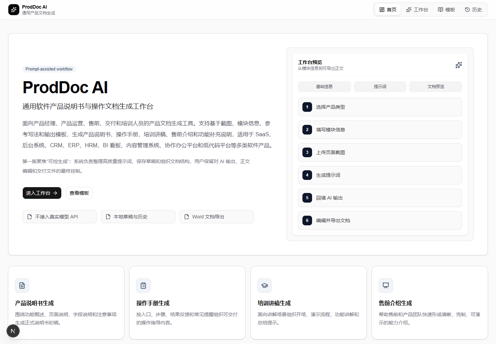
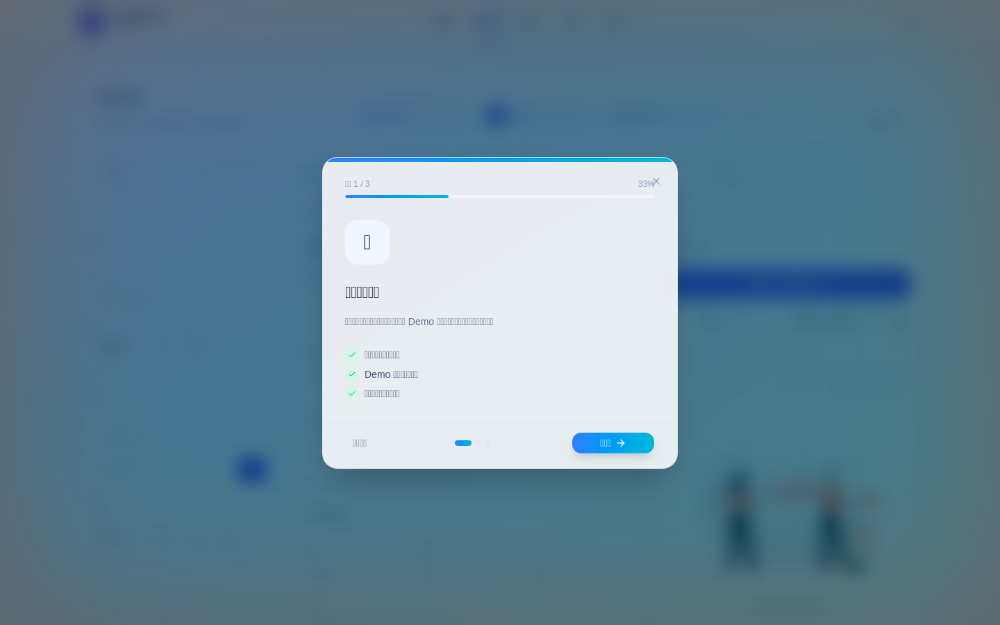
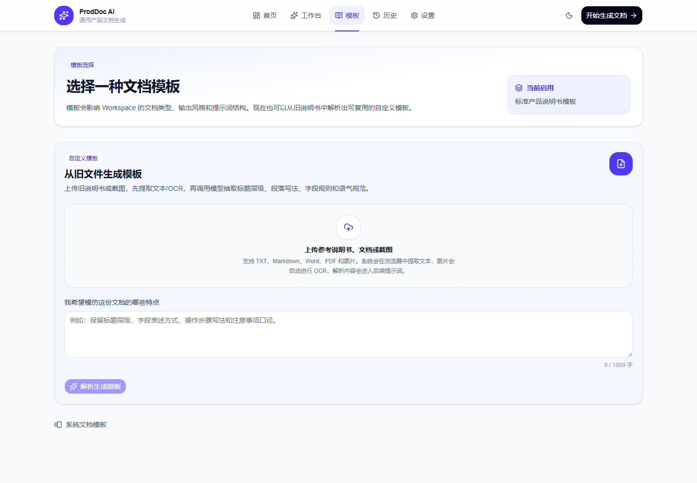
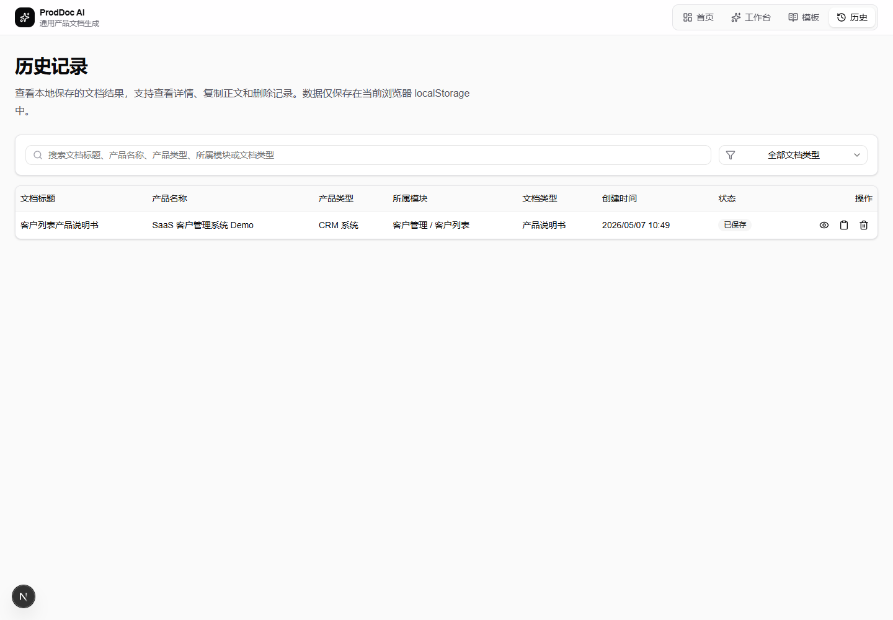

# ProdDoc AI

通用型软件产品说明书与操作文档生成工作台。

**技术栈**：Next.js / TypeScript / Tailwind CSS / shadcn/ui / localStorage / docx / Playwright

**核心能力**：提示词生成 / Mock 文档生成 / Word 导出 / 历史记录 / 模板工作流 / 页面截图验收 / Smoke Test



ProdDoc AI 是一个通用软件产品说明书与操作文档生成工作台，用于把产品类型、功能模块、截图、关键词、参考写法和输出模板整理成可复用的文档生成流程。

项目定位是一个 Prompt-assisted workflow 产品：系统不直接接入API，而是帮助用户生成高质量提示词，再将外部 AI 输出回填到工作台中编辑、保存和导出 Word。

## 项目截图

### Dashboard 首页

Dashboard 用于展示产品定位、核心能力、典型使用流程、适用角色、适用产品类型和最近生成记录。


### Workspace 工作台

Workspace 是核心文档生成工作台，支持 Demo 模块选择、示例内容填充、提示词生成、Mock 文档生成、正文编辑、历史保存和 Word 导出。



### Templates 模板页

Templates 用于选择不同文档生成模板，启用后会影响 Workspace 的默认文档类型、输出风格和提示词方向。



### History 历史记录页

History 用于管理本地生成记录，支持查看、搜索、筛选、复制和删除。



## 目标用户

- 产品经理
- 产品运营
- 售前顾问
- 实施交付人员
- 培训人员

## 核心功能

- Dashboard 首页：展示产品定位、核心能力、典型使用流程、适用角色、适用产品类型和最近生成记录。
- Workspace 工作台：选择 Demo 项目和功能模块，填写文档输入信息，生成提示词和 Mock 文档。
- 模板启用：模板页可启用输出模板，并影响工作台的默认文档类型、输出风格和提示词方向。
- 文档预览：支持正文编辑、复制、保存历史和 Word 导出。
- 截图辅助：支持多图上传、缩略图预览和删除。
- 历史记录：使用 localStorage 保存文档结果，支持查看、复制、删除、搜索和文档类型筛选。
- Smoke Test：使用 Playwright 验证四个核心页面可访问、非空白且主要标题存在。

## 页面结构

- `/`：Dashboard 首页
- `/workspace`：文档生成工作台
- `/templates`：模板页
- `/history`：历史记录页

## 默认 Demo 项目

- SaaS 客户管理系统 Demo
- 内容运营后台 Demo
- 企业协作平台 Demo
- BI 数据看板 Demo

这些 Demo 均用于通用软件产品文档生成场景，不绑定具体客户、具体行业平台或历史项目。

## 技术栈

- Next.js App Router
- TypeScript
- Tailwind CSS
- shadcn/ui + Radix UI
- lucide-react
- docx
- file-saver
- localStorage
- Playwright

## 本地运行

```bash
npm install
npm run dev
```

访问 `http://localhost:3000`。

## 工程兼容说明

当前 Windows 环境下 Next 16 的 Turbopack / SWC native binding 存在兼容问题，并且官方 `next dev` CLI 的内部 fork 在当前环境会触发 `spawn EPERM`。

因此项目采用以下工程兼容处理：

- dev：使用 `node scripts/dev-server.mjs` 启动 Next custom server，并显式选择 Webpack。
- build：使用 `next build --webpack`。
- Next 配置中将构建 worker 收敛到 1，并使用 worker threads，避免当前环境的子进程权限问题。
- Playwright 截图脚本优先使用 bundled Chromium，缺失时回退到本机 Chrome 或 Edge。

以上处理只影响工程启动方式，不影响业务功能。

## 推荐演示流程

1. 打开首页，查看产品定位和适用场景。
2. 进入 Workspace。
3. 从左侧选择一个 Demo 项目和功能模块。
4. 查看自动填充的示例内容。
5. 点击生成提示词。
6. 点击生成 Mock 文档。
7. 编辑文档内容。
8. 保存到历史记录。
9. 导出 Word。
10. 进入 History 查看、搜索、筛选、复制或删除记录。

## 作品集截图生成

```bash
npm run screenshots
```

截图会保存到：

- `public/screenshots/dashboard.png`
- `public/screenshots/workspace.png`
- `public/screenshots/templates.png`
- `public/screenshots/history.png`

## 视觉检查说明

生成截图后建议检查：

- 页面没有明显空白或加载中状态。
- 页面没有异常横向滚动。
- 主要内容没有被遮挡。
- 字体、卡片、按钮层级清晰。
- Workspace 截图能体现三栏工作台。
- Dashboard 截图能体现作品集展示感。
- 截图中不出现具体客户、具体行业平台或历史项目内容。

## 测试与检查命令

```bash
npm run lint
npx tsc --noEmit
npm run build
npm run dev
npm run screenshots
npm run test:e2e
```

如需查看浏览器运行过程：

```bash
npm run test:e2e:headed
```

## 后续规划

- 支持模板在工作台内切换。
- 增加更细的文档结构预设。
- 增加导出格式配置。
- 增加更完整的端到端交互测试和视觉回归检查。
