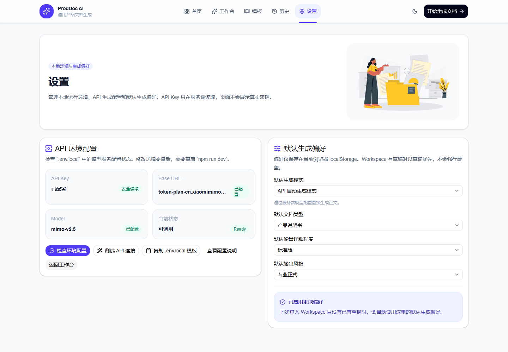

# ProdDoc AI

通用型软件产品说明书与操作文档生成工作台。

**技术栈**：Next.js / TypeScript / Tailwind CSS / shadcn/ui / localStorage / docx / Playwright

**核心能力**：提示词生成 / API 自动生成 / Mock 文档生成 / Word 导出 / 历史记录 / 模板工作流 / 环境配置检查 / 页面截图验收 / Smoke Test


ProdDoc AI 是一个通用软件产品说明书与操作文档生成工作台，用于把产品类型、功能模块、截图、关键词、参考写法和输出模板整理成可复用的文档生成流程。

项目支持“提示词辅助 + API 自动生成”双模式：未配置模型服务时可继续生成提示词和 Mock 文档；配置模型服务后，可通过服务端 API Route 自动生成正文，并继续编辑、保存和导出 Word。

## 项目截图

### Dashboard 首页

Dashboard 用于展示产品定位、核心能力、典型使用流程、适用角色、适用产品类型和最近生成记录。


### Workspace 工作台

Workspace 是核心文档生成工作台，支持 Demo 模块选择、示例内容填充、提示词生成、API 自动生成、Mock 文档生成、正文编辑、历史保存和 Word 导出。


### Templates 模板页

Templates 用于选择不同文档生成模板，启用后会影响 Workspace 的默认文档类型、输出风格和提示词方向。


### History 历史记录页

History 用于管理本地生成记录，支持查看、搜索、筛选、复制和删除。


### Settings 设置页

Settings 用于检查本地 API 环境配置、测试模型服务连接、复制 `.env.local` 模板，并管理默认生成偏好。



## 项目定位

ProdDoc AI 面向产品经理、产品运营、售前顾问、实施交付人员和培训人员，帮助他们基于通用软件产品的模块信息、关键词、参考写法和模板结构，快速形成可编辑、可保存、可导出的产品文档初稿。

项目不依赖登录和数据库，文档草稿、历史记录和默认生成偏好使用浏览器 localStorage 保存，适合作为前端作品集、交互原型和轻量演示工具。

## 核心功能

- Dashboard 首页：展示产品定位、核心能力、典型使用流程、适用角色、适用产品类型和最近生成记录。
- Workspace 工作台：选择 Demo 项目和功能模块，填写文档输入信息，选择提示词辅助、API 自动生成或 Mock 文档生成模式。
- API 自动生成：通过 `/api/generate` 服务端接口读取环境变量并调用 OpenAI-compatible Chat Completions 服务，API Key 不会暴露到前端。
- Settings 设置页：通过 `/api/env-status` 检查环境配置，通过 `/api/test-ai` 测试 API 连接，并保存默认生成偏好。
- 模板启用：模板页可启用输出模板，并影响工作台的默认文档类型、输出风格和提示词方向。
- 文档预览：支持正文编辑、复制、保存历史和 Word 导出。
- 截图辅助：支持多图上传、缩略图预览和删除。
- 历史记录：使用 localStorage 保存文档结果，支持查看、复制、删除、搜索和文档类型筛选。
- Smoke Test：使用 Playwright 验证核心页面可访问、非空白且主要标题存在。

## 页面结构

- `/`：Dashboard 首页
- `/workspace`：文档生成工作台
- `/templates`：模板页
- `/history`：历史记录页
- `/settings`：设置页

## 默认 Demo 项目

- SaaS 客户管理系统 Demo
- 内容运营后台 Demo
- 企业协作平台 Demo
- BI 数据看板 Demo

这些 Demo 均用于通用软件产品文档生成场景，不绑定具体客户、具体行业平台或历史项目。

## 本地运行

```bash
npm install
npm run dev
```

访问 `http://localhost:3000`。

## 设置与 API 环境配置

进入顶部导航的“设置”或访问 `/settings`，可以检查本地 API 环境配置、测试 API 连接，并复制 `.env.local` 模板。

在项目根目录创建 `.env.local`：

```bash
AI_API_KEY=your_api_key_here
AI_BASE_URL=https://your-provider-compatible-endpoint
AI_MODEL=your-model-name
```

安全说明：

- `.env.local` 已通过 `.gitignore` 忽略，不应提交到仓库。
- `AI_API_KEY` 只在服务端 API Route 中读取。
- 前端只请求本项目的服务端接口，不会接触或展示真实密钥。
- 修改 `.env.local` 后需要重启 `npm run dev`，再进入 Settings 检查配置状态。

三种生成方式：

- 提示词辅助模式：生成结构化提示词，用户复制到常用 AI 工具中继续生成正文。
- API 自动生成模式：服务端使用完整提示词调用模型服务，返回正文后自动填入文档预览区。
- Mock 文档模式：不依赖任何 API，用于离线演示、作品集截图和快速生成初稿。

Settings 中的默认生成偏好保存在 localStorage。进入 Workspace 时，如果没有已有草稿，会使用这些默认偏好；如果已有草稿，则以草稿优先。

未配置 API 时，提示词模式和 Mock 文档模式仍然可用。

## 工程兼容说明

当前 Windows 环境下 Next 16 的 Turbopack / SWC native binding 存在兼容问题，并且官方 `next dev` CLI 的内部 fork 在当前环境会触发 `spawn EPERM`。

因此项目采用以下工程兼容处理：

- dev：使用 `node scripts/dev-server.mjs` 启动 Next custom server，并显式选择 Webpack。
- build：使用 `next build --webpack`。
- Next 配置中将构建 worker 收敛到 1，并使用 worker threads，避免当前环境的子进程权限问题。
- Playwright 截图脚本优先使用 bundled Chromium，缺失时回退到本机 Chrome 或 Edge。

以上处理只影响工程启动方式，不影响业务功能。

## 推荐演示流程

1. 打开首页，查看产品定位和适用场景。
2. 进入 Settings，检查 API 环境配置并复制 `.env.local` 模板。
3. 进入 Workspace。
4. 从左侧选择一个 Demo 项目和功能模块。
5. 查看自动填充的示例内容。
6. 选择“复制提示词模式”或“API 自动生成模式”。
7. 点击生成提示词、调用 API 生成正文，或使用 Mock 文档生成离线初稿。
8. 编辑文档内容。
9. 保存到历史记录。
10. 导出 Word。
11. 进入 History 查看、搜索、筛选、复制或删除记录。

## 作品集截图生成

```bash
npm run screenshots
```

截图会保存到：

- `public/screenshots/dashboard.png`
- `public/screenshots/workspace.png`
- `public/screenshots/templates.png`
- `public/screenshots/history.png`
- `public/screenshots/settings.png`

## 视觉检查说明

生成截图后建议检查：

- 页面没有明显空白或加载中状态。
- 页面没有异常横向滚动。
- 主要内容没有被遮挡。
- 卡通人物插画在 Dashboard、Workspace、History 中清晰可见。
- 字体、卡片、按钮层级清晰。
- Workspace 截图能体现文档生成工作台。
- Dashboard 截图能体现作品集展示感。
- 截图中不出现具体客户、具体行业平台或历史项目内容。

## 测试与检查命令

```bash
npm run lint
npx tsc --noEmit
npm run build
npm run dev
npm run screenshots
npm run test:e2e
```

如需查看浏览器运行过程：

```bash
npm run test:e2e:headed
```

## 后续规划

- 支持流式输出，减少 API 自动生成等待感。
- 增加模型选择和温度参数配置。
- 增加 OCR，将截图中的页面信息转为可编辑参考内容。
- 增加视觉模型分析截图，辅助生成页面说明和字段说明。
- 增加更细的文档结构预设和导出格式配置。

## Illustration Credits

Illustrations by Storyset. Character illustrations are stored locally as SVG assets under `public/images/characters/`. The project does not hotlink external illustration files.
