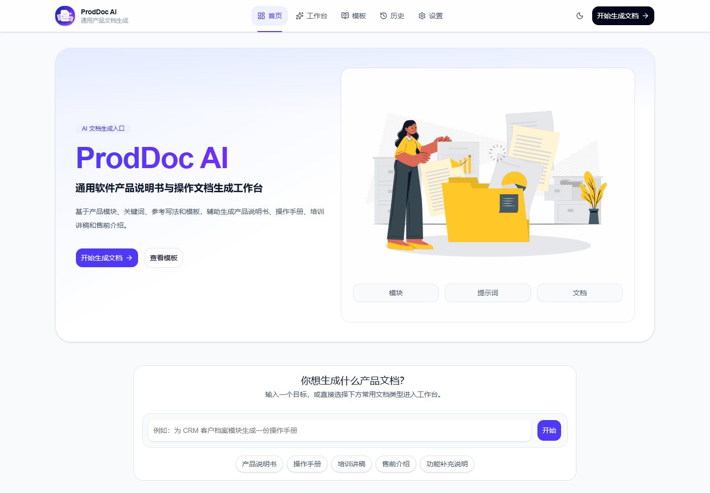
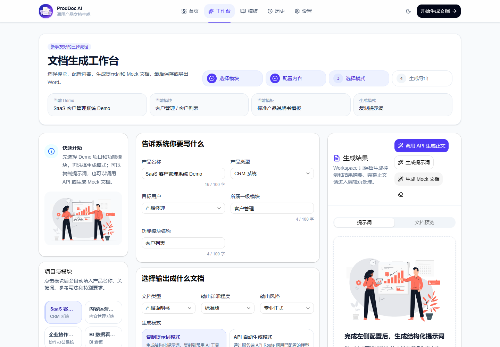
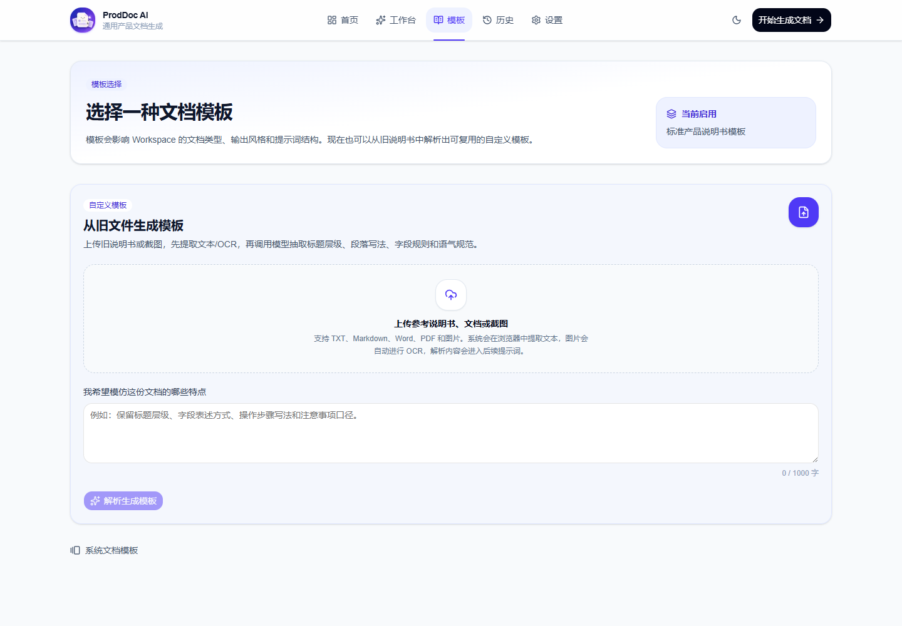
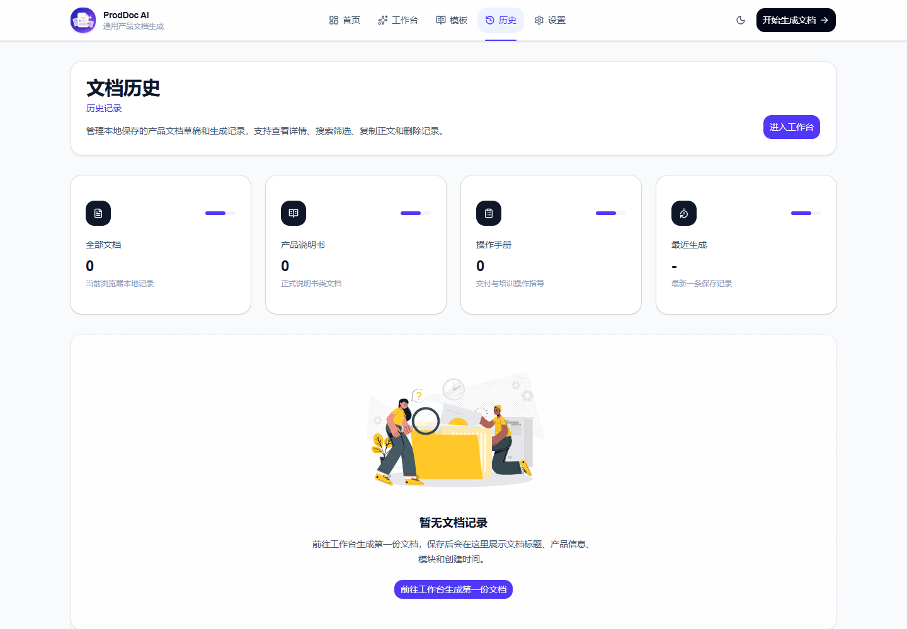
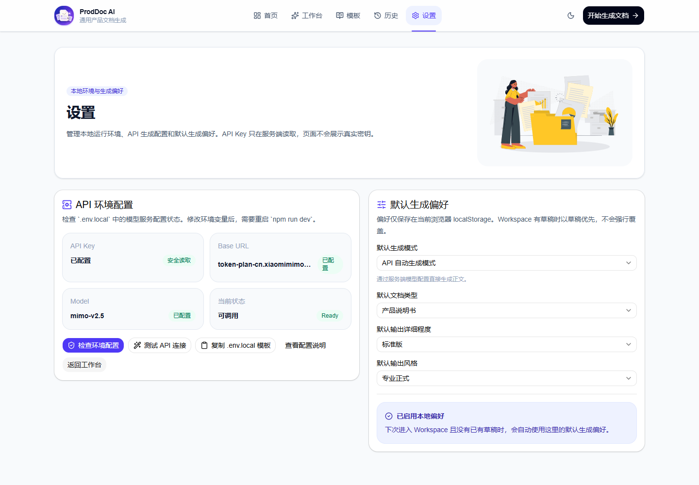

# ProdDoc AI

通用型软件产品说明书与操作文档生成工作台。它面向产品经理、产品运营、售前顾问、实施交付人员和培训人员，把产品类型、功能模块、参考资料、截图和模板规则整理成可编辑、可保存、可导出的文档生成流程。



## 当前状态

- 运行形态：本地优先的 Next.js 16 工作台，可作为作品集演示或轻量内部原型使用。
- 生成模式：提示词辅助、API 自动生成、Mock 文档三种模式。
- 模型接入：通过服务端 API Route 调用 OpenAI-compatible Chat Completions，密钥只读取服务端环境变量。
- 数据保存：草稿、历史记录、启用模板、自定义模板和默认偏好均保存在浏览器 localStorage。
- 截图状态：`npm run screenshots` 可重新启动项目并生成 Dashboard、Workspace、Templates、History、Settings 五张作品集截图。

## 核心能力

- Dashboard：展示产品定位、模板入口、适用角色、Demo 项目和最近生成记录。
- Workspace：选择 Demo 项目和模块，填写产品信息、参考写法、截图和参考资料，生成提示词或正文。
- 三种生成模式：复制提示词模式、API 自动生成模式、Mock 文档模式，未配置模型服务时仍可离线演示。
- 文档预览与编辑：生成后先显示摘要卡片，可复制全文、保存历史、导出 Word，或进入 `/editor` 做全文编辑与局部改写。
- Templates：内置系统模板，也支持从旧说明书、文档或截图中解析标题层级、段落写法、字段规则和语气规范，保存为自定义模板。
- 参考资料解析：支持 TXT、Markdown、Word、PDF 和图片；Word 使用 `mammoth` 提取文本，PDF 使用 `pdfjs-dist` 提取文本，图片使用 `tesseract.js` 做 OCR。
- History：本地保存文档结果，支持搜索、筛选、复制、删除和进入编辑器。
- Settings：检查 API 环境变量、测试模型连接、复制 `.env.local` 模板并保存默认生成偏好。
- 工程验证：提供 Playwright smoke test 与截图脚本，用于检查主要页面可访问且非空白。

## 技术栈

- Next.js 16.2.4 / React 19 / TypeScript
- Tailwind CSS v4 / shadcn/ui / Radix UI / lucide-react
- docx / mammoth / pdfjs-dist / tesseract.js / file-saver
- localStorage 本地持久化
- Playwright 截图与端到端 smoke test
- OpenAI-compatible Chat Completions API

## 项目截图

### Dashboard 首页

Dashboard 用于展示产品定位、核心能力、模板入口、Demo 项目和最近生成记录。


### Workspace 工作台

Workspace 是核心文档生成工作台，支持 Demo 模块选择、内容配置、参考资料解析、提示词生成、API 自动生成、Mock 文档生成、历史保存和 Word 导出。



### Templates 模板页

Templates 用于选择系统模板，也可以从旧说明书、文档或截图中解析并保存自定义模板。



### History 历史记录页

History 用于管理本地生成记录，支持查看、搜索、筛选、复制、删除和继续编辑。



### Settings 设置页

Settings 用于检查本地 API 环境配置、测试模型连接、复制 `.env.local` 模板，并保存默认生成偏好。



## 页面结构

```text
/
/workspace
/templates
/history
/settings
/editor
/api/generate
/api/rewrite
/api/templates/extract
/api/env-status
/api/test-ai
```

## 默认 Demo 项目

- SaaS 客户管理系统 Demo
- 内容运营后台 Demo
- 企业协作平台 Demo
- BI 数据看板 Demo

这些 Demo 用于通用软件产品文档生成场景，不绑定具体客户、具体行业平台或历史项目。

## 本地运行

```bash
npm install
npm run dev
```

访问 `http://localhost:3000`。

当前 Windows 环境下项目使用 `scripts/dev-server.mjs` 启动 Next custom server，并显式选择 Webpack，以规避当前机器上 Turbopack / SWC native binding 和 fork 权限相关问题。

## API 环境配置

在项目根目录创建 `.env.local`：

```bash
AI_API_KEY=your_api_key_here
AI_BASE_URL=https://your-provider-compatible-endpoint
AI_MODEL=your-model-name
```

说明：

- `.env.local` 已通过 `.gitignore` 忽略，不应提交到仓库。
- `AI_API_KEY` 只在服务端 API Route 中读取。
- 前端只请求本项目的服务端接口，不会接触或展示真实密钥。
- 修改 `.env.local` 后需要重启 `npm run dev`，再进入 Settings 检查配置状态。

## 截图生成

```bash
npm run screenshots
```

截图会保存到：

- `public/screenshots/dashboard.png`
- `public/screenshots/workspace.png`
- `public/screenshots/templates.png`
- `public/screenshots/history.png`
- `public/screenshots/settings.png`

截图脚本会在本机 Chrome/Edge 可用时自动回退到系统浏览器。生成后应检查中文是否正常、页面非空白、主要内容没有被遮挡。

## 测试与检查命令

```bash
npm run lint
npx tsc --noEmit
npm run build
npm run screenshots
npm run test:e2e
```

## 后续规划

- 增强长文档分章节生成与章节状态管理。
- 增加更多导出格式和模板结构配置。
- 优化自定义模板解析结果的人工校正体验。
- 增加更细的模型参数配置和错误诊断。

## Illustration Credits

Illustrations by Storyset. Character illustrations are stored locally as SVG assets under `public/images/characters/`. The project does not hotlink external illustration files.
